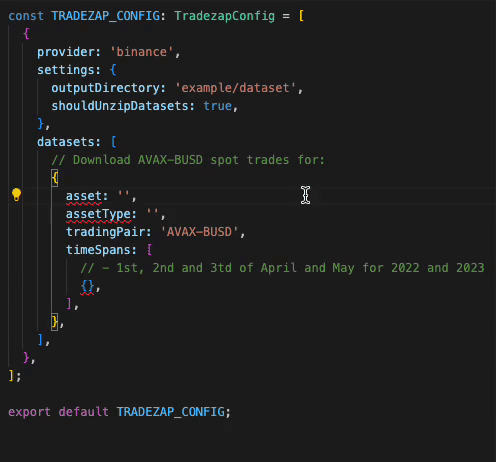
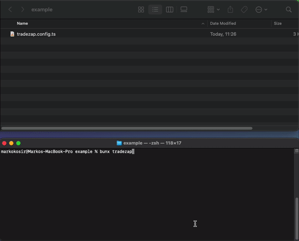

# TradeZap

[![npm version][npm-badge]][npm-url]
[![npm downloads][downloads-badge]][npm-url]
[![CI][ci-badge]][ci-url]
[![TypeScript][typescript-badge]][typescript-url]

_⚡ Get trading data in a zap_

Easily define which trading data to download 🚀

[](https://github.com/ocignis/tradezap)

## Usage

- `npm i --save-dev tradezap`
- Define which trading data you want in `tradezap.config.ts` file ([example](example/tradezap.config.ts))
- Run `npx tradezap`
- Trading data are ready to use 📈

## Grab Trading Data 🚀

Easily define which trading data to download in `tradezap.config.ts` file ([example](example/tradezap.config.ts))

```ts
// Download ETH-BUSD daily spot trades for 1st and 2nd of January 2021, 2022 and 2023
{
  tradingPair: 'ETH-BUSD',
  asset: 'spot',
  assetType: 'trades',
  timeSpans: [
    {
      period: 'daily',
      years: [2021, 2022, 2023],
      months: [1],
      days: [1, 2],
    },
  ],
},
// Download AVAX-BUSD monthly spot trades for August and September 2023
{
  tradingPair: 'AVAX-BUSD',
  asset: 'spot',
  assetType: 'trades',
  timeSpans: [
    {
      period: 'monthly',
      years: [2023],
      months: [8, 9],
    },
  ],
},
...
```

TradeZap CLI tool keeps your trading data up to date.

[](https://github.com/ocignis/tradezap)

## Data Providers

Currently supported data providers:

- [Binance](https://www.binance.com/)

## Development

Requirement - [Bun v1.0.19+](https://bun.sh)

_Easily set up a local development environment!_

- clone
- `bun i`
- `bun run dev`

_Start coding!_

## Contributing

All contributions are welcome!

[npm-url]: https://www.npmjs.com/package/tradezap
[npm-badge]: https://img.shields.io/npm/v/tradezap.svg
[downloads-badge]: https://img.shields.io/npm/dm/tradezap.svg?color=blue
[ci-badge]: https://github.com/ocignis/tradezap/actions/workflows/CI.yml/badge.svg
[ci-url]: https://github.com/ocignis/tradezap/actions/workflows/CI.yml
[typescript-badge]: https://badges.frapsoft.com/typescript/code/typescript.svg?v=101
[typescript-url]: https://github.com/microsoft/TypeScript
